```{r include = FALSE}
knitr::opts_chunk$set(
  collapse = F, echo = T, message=FALSE, warning=FALSE,
  comment = "#>",
  out.width = "50%")
library(knitr)
```

- [Distribución de superficie](#distribuci-n-de-superficie)
  * [Soja 1era / soja 2°](#soja-1era---soja-2-)
  * [Grupos de madurez](#grupos-de-madurez)
  * [Biotecnologías](#biotecnolog-as)
- [Manejo](#manejo)
  * [Fecha de siembra](#fecha-de-siembra)
  * [Cultivo antecesor](#cultivo-antecesor)
  * [Fósforo](#f-sforo)
- [Variedades](#variedades)
  * [Superficie](#superficie)
  * [Performance](#performance)

[Figuras](https://github.com/juanchiem/soybean/tree/master/plots)

[Datos](https://github.com/juanchiem/soybean/tree/master/data) 

# Distribución de superficie

## Soja 1era / soja 2°

## Grupos de madurez

## Biotecnologías 

# Manejo

## Fecha de siembra

## Cultivo antecesor

## Fósforo

# Variedades

## Superficie
    
## Performance


```{r message=FALSE, warning=FALSE, include=FALSE}
# pacman::p_load(tidyverse) 
# dat <- read_csv(here::here("data/clean_data.csv"))
# load(here::here("soy_dat.Rdata"))
```


# Superficies

## Superficie por zona / regional / campaña
sup_campana_zona.png
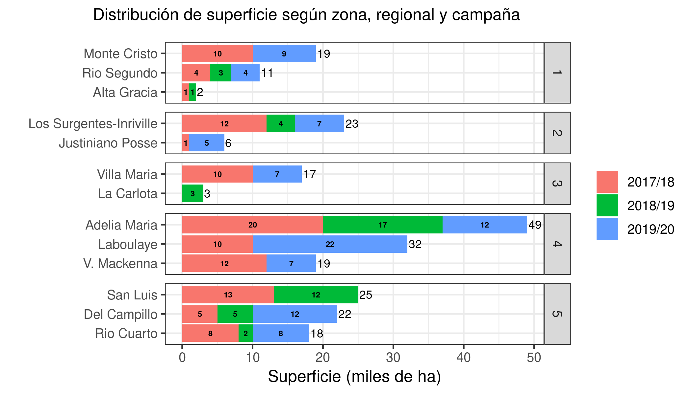

```{r}

```

## Area de siembra de GM por zona y tipo de cultivo de soja
tortas_soja_GM.png
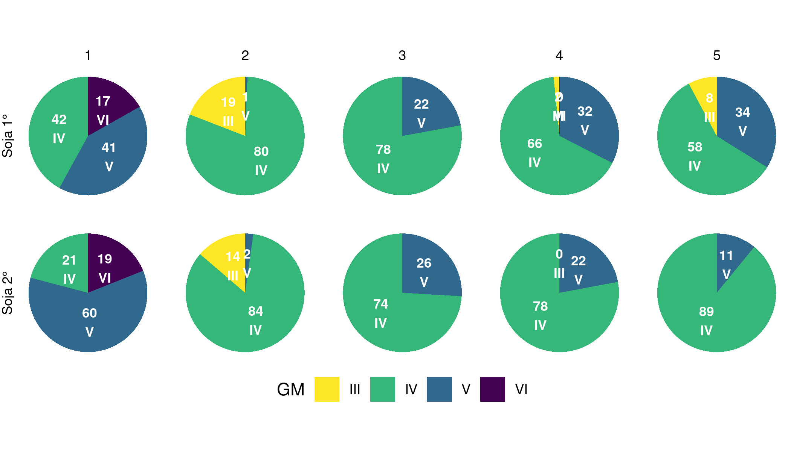

## Tree maps
sup_sj.png


sup_sj1.png
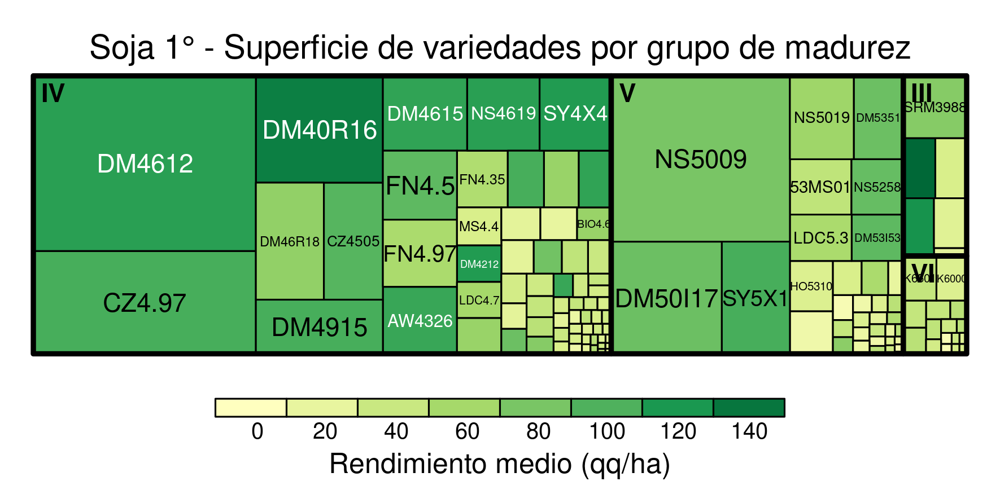

sup_sj1_GM3.png
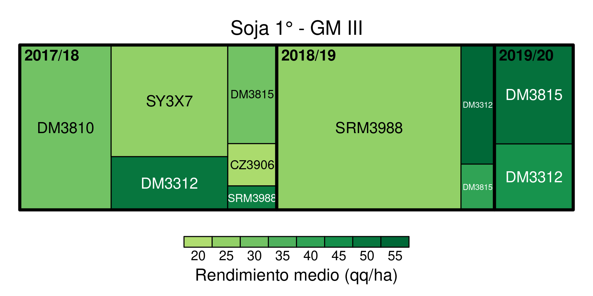

sup_sj1_GM4.png


sup_sj1_GM5.png
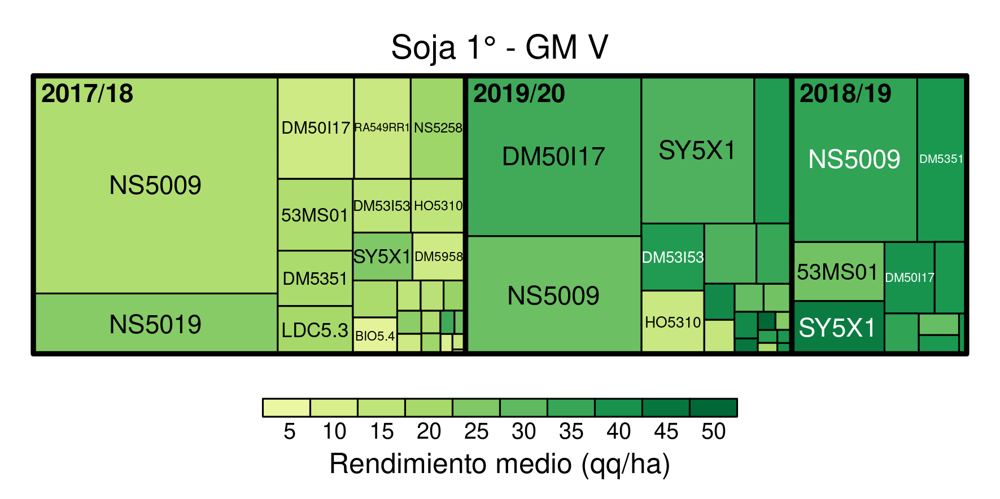

sup_sj1_GM6.png


sup_sj2.png


## Adopcion de tencologias

evolucion_RR.png
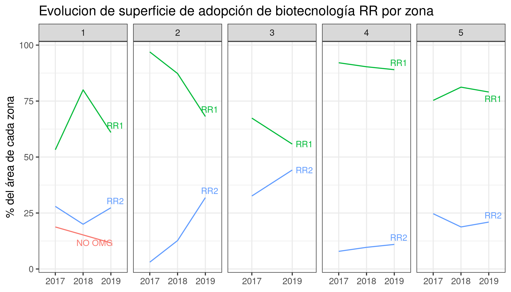

evolucion_STS.png
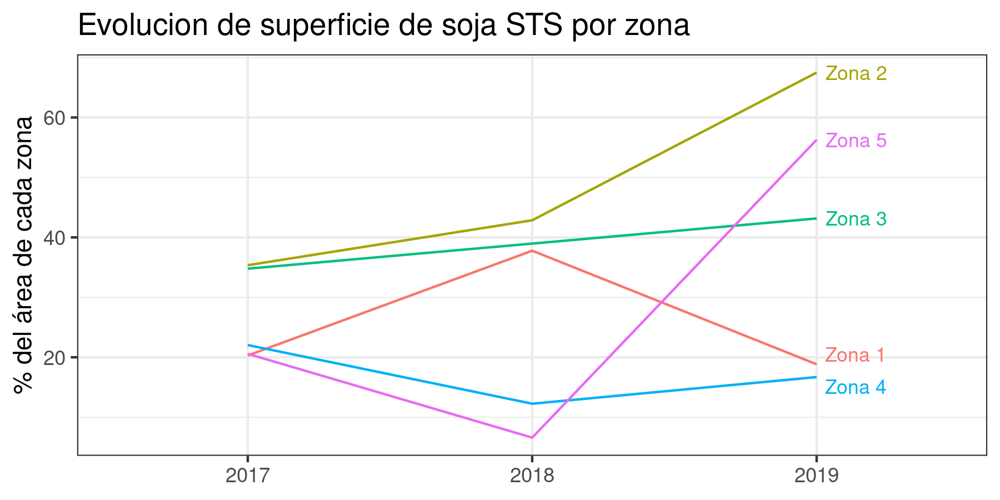

# Manejo 

## Ventanas de siembra por zona / GM

ventanas_siembra_campana.png


### Soja 1° 

ventanas_siembra_sj1_GM.png


ventanas_siembra_sj1_GM_campana.png
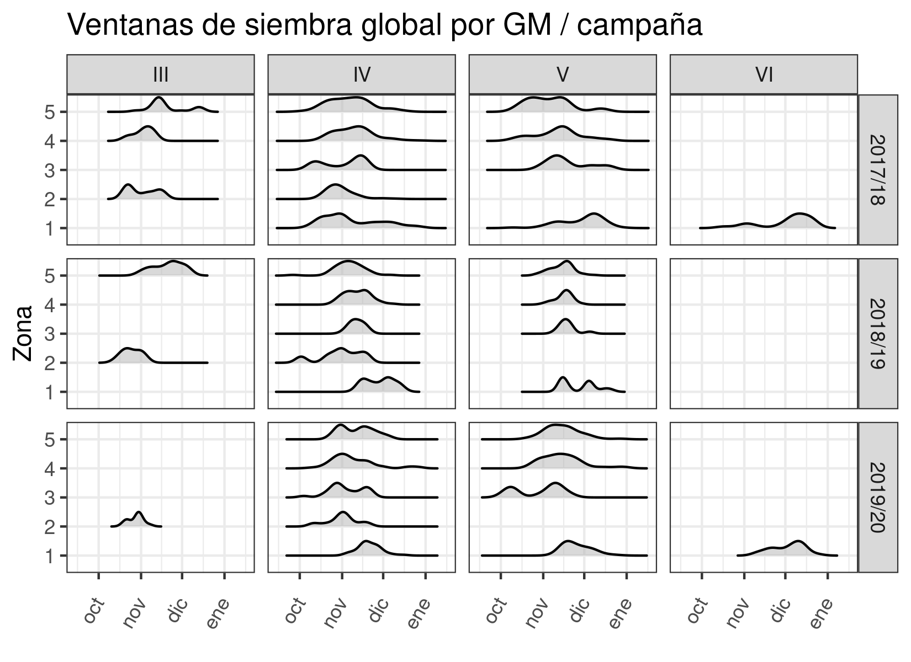

fosforo_respuesta18.png
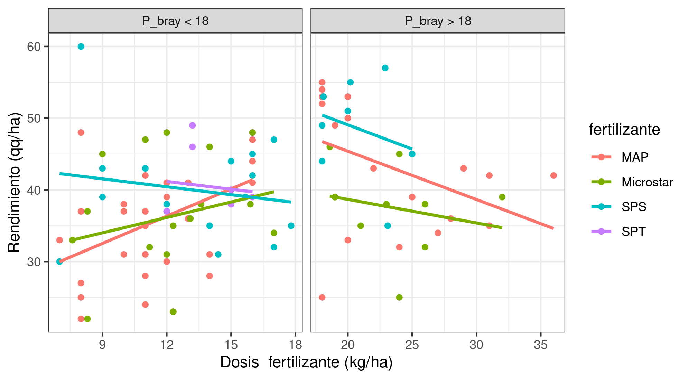


### Soja 2° 

ventanas_siembra_sj2.png
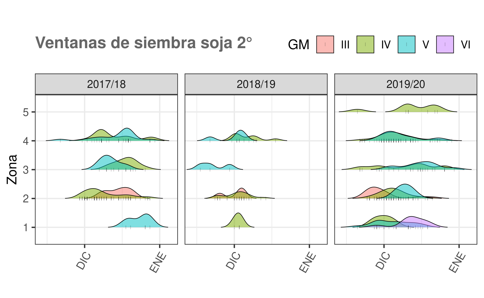

## Rendimientos por fecha de siembra x zona

(El suavizado de la tendencia esta hecho con modelo polinomial de grado 2, o sea que puede ser lineal o cuadratico el ajuste)

### Soja 1°

rinde_Fsiembra_sj1.png
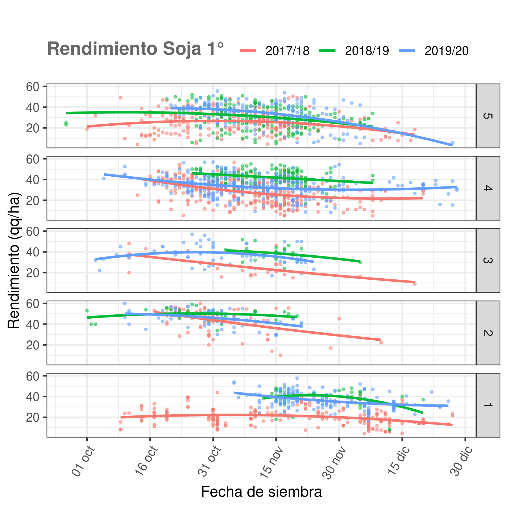

### Soja 2°

rinde_Fsiembra_sj2.png
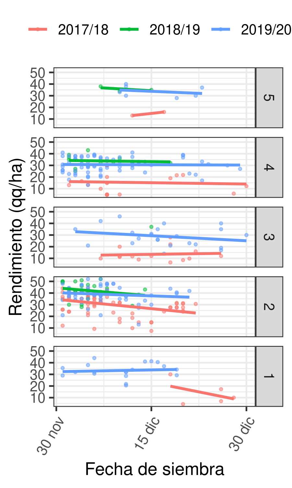

## Efecto Antecesor

### Con efecto napa

efecto_antecesor_napa.png
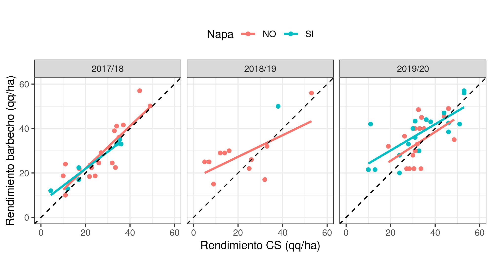

### Sin efecto napa

efecto_antecesor.png
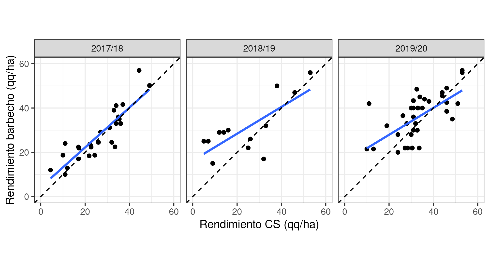

## Fósforo 
fosforo_respuesta.png
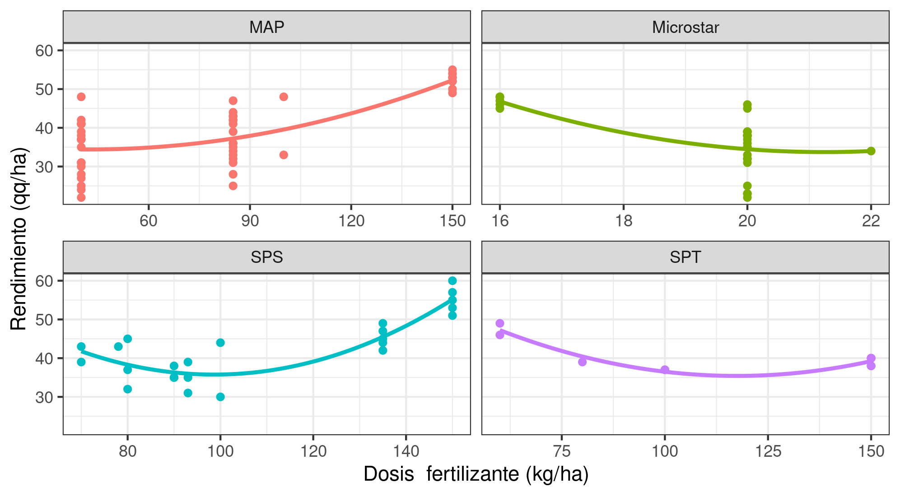

fosforo_dosis.png
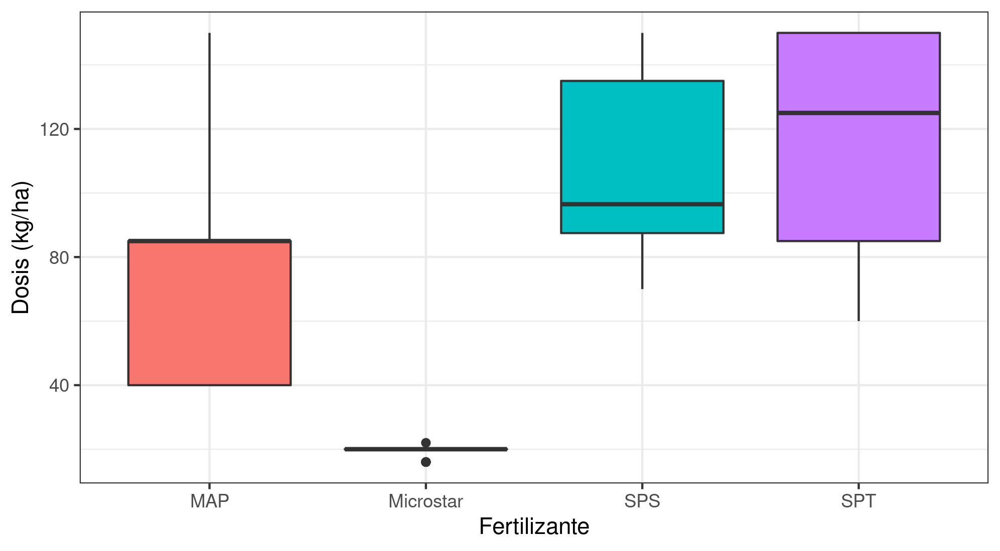

balance_fosforo.png
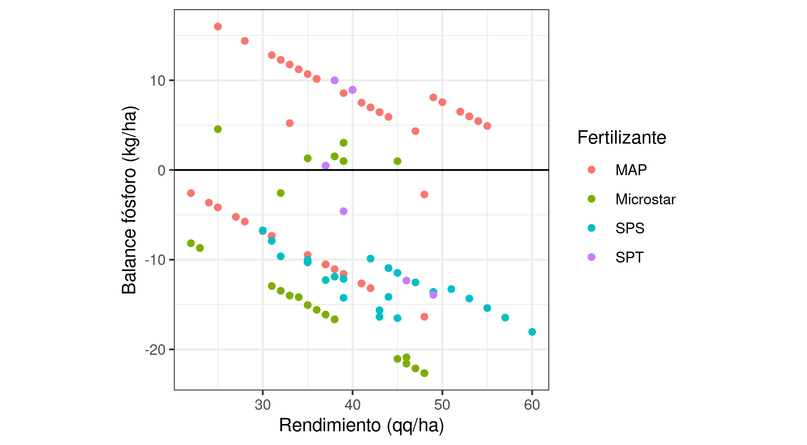

fosforo_respuesta12.png


fosforo_respuesta18.png


# Variedades

## Potencial ambiente

potencial_ambiente.png


[Soja 1° - rinde de variedades mas sembradas por zona](https://docs.google.com/spreadsheets/d/1YL6vwgVu1nyMuZLRZw5uMav7cMt2mDXd7mI2S8Q6Q7c/edit#gid=285024912)
