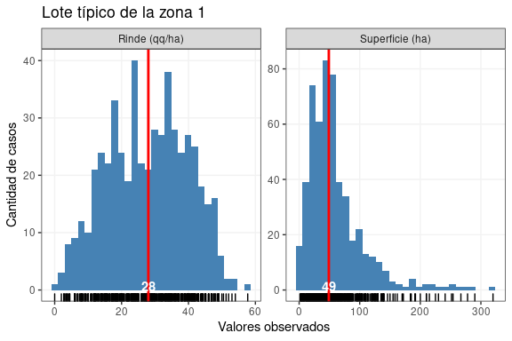
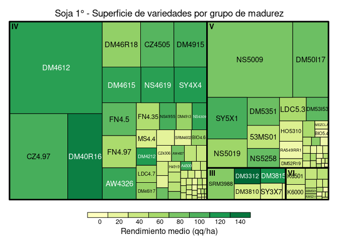
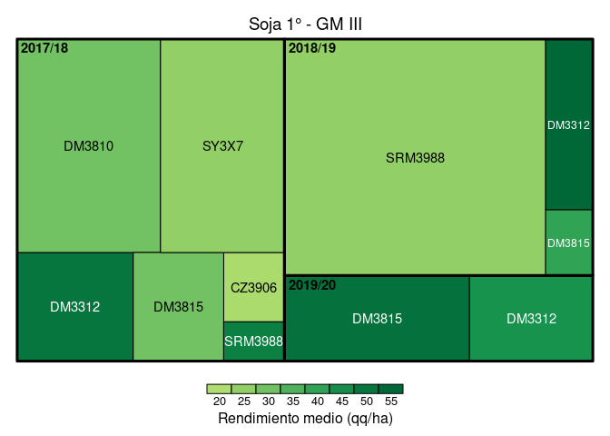

Referencias para tener en cuenta:

[Revista Horizonte
digital](https://issuu.com/horizonteadigital/docs/ha_130)

## Dataset

    #> Rows: 2,707
    #> Columns: 27
    #> $ id_lote                 <dbl> 1, 2, 3, 4, 5, 6, 7, 8, 9, 10, 11, 12, 13, 14…
    #> $ campana                 <chr> "2017/18", "2017/18", "2017/18", "2017/18", "…
    #> $ zona                    <chr> "1", "1", "1", "1", "1", "1", "1", "1", "1", …
    #> $ regional                <chr> "Alta Gracia", "Alta Gracia", "Alta Gracia", …
    #> $ localidad               <list> [0, 0, 0, 0, 0, 0, 0, 0, "Villa del Rosario"…
    #> $ clase_de_suelo          <list> ["III", "III", "III", "III", "III", "III", "…
    #> $ cultivo                 <chr> "soja_1", "soja_1", "soja_1", "soja_1", "soja…
    #> $ superficie              <dbl> 13.71, 14.50, 15.87, 80.00, 100.00, 101.70, 1…
    #> $ rinde                   <dbl> 4.50, 3.50, 3.90, 34.00, 37.00, 2.70, 2.80, 3…
    #> $ antecesor_invernal_18_1 <list> ["Maíz", "Maíz", "Maíz", "Maíz", "Maíz", "Ma…
    #> $ antecesor_estival_17_18 <lgl> NA, NA, NA, NA, NA, NA, NA, NA, NA, NA, NA, N…
    #> $ fecha_siembra           <date> 2018-12-15, 2018-12-15, 2018-12-15, 2018-12-…
    #> $ variedad                <chr> "DM50I19", "DM50I17", "DM50I18", "DM5258", "D…
    #> $ biotecnologia           <chr> "IPRO", "IPRO", "IPRO", "RR", "IPRO", "IPRO",…
    #> $ GM                      <chr> "V", "V", "V", "V", "V", "V", "V", "V", "V", …
    #> $ semillero               <chr> "DON MARIO", "DON MARIO", "DON MARIO", "DON M…
    #> $ espaciamiento_cm        <dbl> 52, 52, 52, 52, 52, 42, 42, 52, 42, 52, 52, 0…
    #> $ densidad                <lgl> NA, NA, NA, NA, NA, NA, NA, NA, NA, NA, NA, N…
    #> $ riego                   <chr> "NO", "NO", "NO", "NO", "NO", "NO", "NO", "NO…
    #> $ napa                    <list> ["SI", "SI", "SI", "SI", "SI", "SI", "SI", "…
    #> $ agua_inicio             <list> [0, 0, 0, 0, 0, 0, 0, 0, "Medio", 0, 0, 0, 0…
    #> $ adversidad_1            <list> [0, 0, 0, 0, 0, 0, 0, 0, "Sequía", "Sequía",…
    #> $ dano_1                  <dbl> 0, 0, 0, 0, 0, 0, 0, 0, 0, 0, 0, 0, 0, 0, 0, …
    #> $ adversidad_2            <lgl> NA, NA, NA, NA, NA, NA, NA, NA, NA, NA, NA, N…
    #> $ dano_2                  <dbl> 0, 0, 0, 0, 0, 0, 0, 0, 0, 0, 0, 0, 0, 0, 0, …
    #> $ dano_tot                <dbl> 0, 0, 0, 0, 0, 0, 0, 0, 0, 0, 0, 0, 0, 0, 0, …
    #> $ id_row                  <int> 1, 2, 3, 4, 5, 6, 7, 8, 9, 10, 11, 12, 13, 14…

  - Nro de observaciones por campaña / ecoregión / regional

<!-- -->

  - Cantidad de datos/faltantes por variable

| variable                   | datos | datos\_faltantes |
| :------------------------- | ----: | ---------------: |
| id\_lote                   |  2707 |                0 |
| campana                    |  2707 |                0 |
| zona                       |  2707 |                0 |
| regional                   |  2707 |                0 |
| localidad                  |  2707 |                0 |
| clase\_de\_suelo           |  2520 |              187 |
| cultivo                    |  2707 |                0 |
| superficie                 |  2707 |                0 |
| rinde                      |  2696 |               11 |
| antecesor\_invernal\_18\_1 |  2673 |               34 |
| antecesor\_estival\_17\_18 |     0 |             2707 |
| fecha\_siembra             |  2663 |               44 |
| variedad                   |  2707 |                0 |
| biotecnologia              |  2616 |               91 |
| GM                         |  2699 |                8 |
| semillero                  |  2707 |                0 |
| espaciamiento\_cm          |  2702 |                5 |
| densidad                   |   946 |             1761 |
| riego                      |  2693 |               14 |
| napa                       |  2707 |                0 |
| agua\_inicio               |  2603 |              104 |
| adversidad\_1              |  2706 |                1 |
| dano\_1                    |  2572 |              135 |
| adversidad\_2              |     0 |             2707 |
| dano\_2                    |  2681 |               26 |
| dano\_tot                  |  2568 |              139 |
| id\_row                    |  2707 |                0 |

## Distribución de variedades: superficie (tamaño de cuadrados) y rendimientos (intensidad de color) por GM

<!-- -->

<!-- -->

## Fecha de siembra x GM

  - Evolución de fecha de siembra por zona

<!-- -->

## Fecha de siembra x rinde

  - Rendimientos por fecha de siembra x zona

<!-- -->

> Obs: elimine siembras de soja 2° anteriores al 1/12. Algo similar
> habria que hacer respecto a las soja 1°: eliminar siembras posteriores
> a 15/12?

  - Tomar las 5 variedades mas sembradas de cada GM y ver distribucion
    de rendimientos (por zona, para no meter ruido del potencial de las
    mismas??

## Variedades

### Soja 1°

<!-- -->

### Soja 2°

<!-- -->

  - Evolución de uso de biotecnologia por campaña

<!-- -->

  - Efecto napa y agua a la siembra por año y por zona

  - Arbol de regresion para rendimiento: que variables explican cada
    rango de rendimiento??
