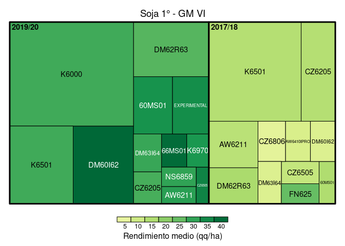
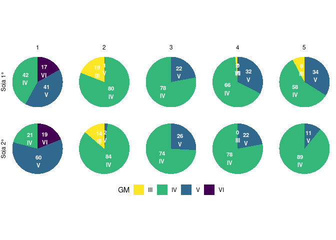
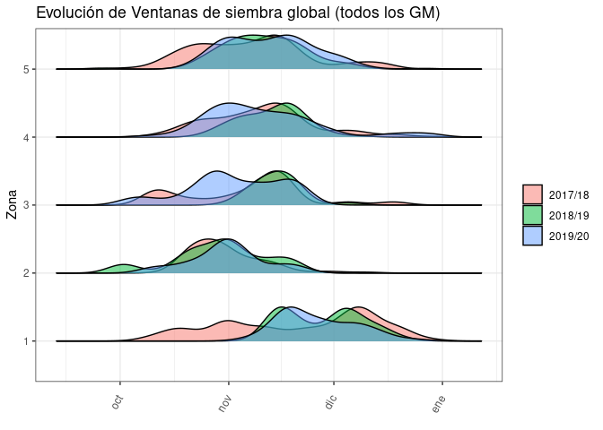
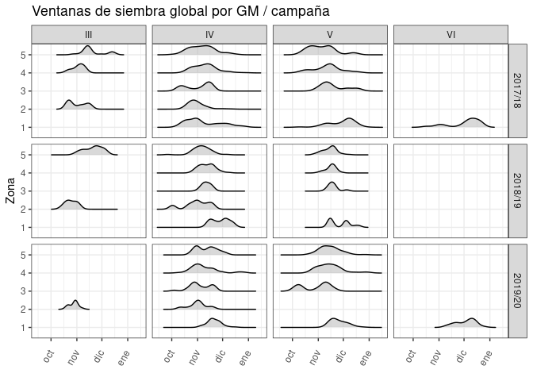
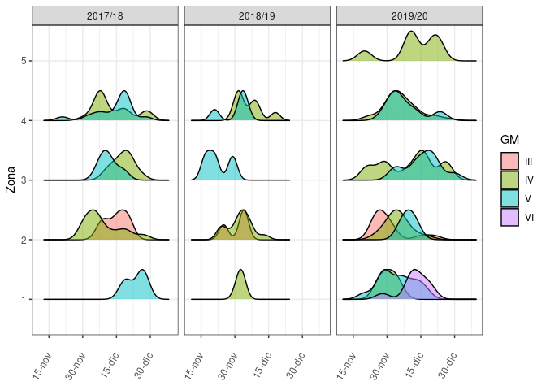
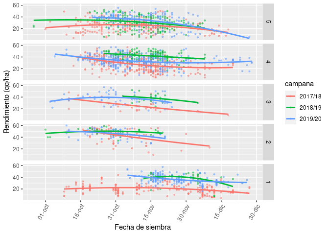
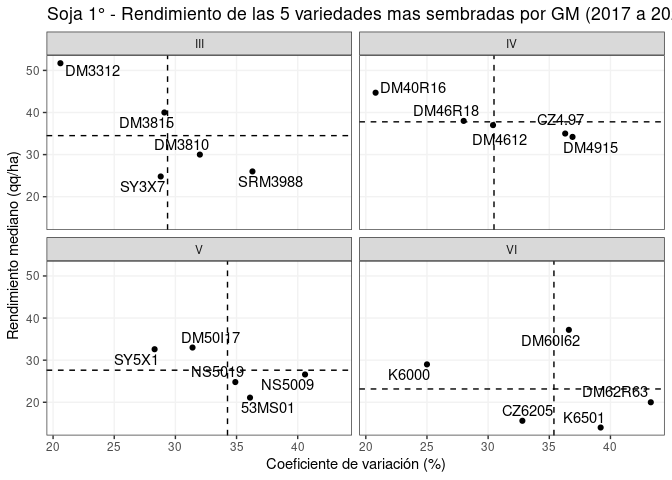

## Dataset

    #> Rows: 2,707
    #> Columns: 28
    #> $ id_lote                 <dbl> 1, 2, 3, 4, 5, 6, 7, 8, 9, 10, 11, 12, 13, 14…
    #> $ campana                 <chr> "2017/18", "2017/18", "2017/18", "2017/18", "…
    #> $ zona                    <fct> 1, 1, 1, 1, 1, 1, 1, 1, 1, 1, 1, 1, 1, 1, 1, …
    #> $ regional                <chr> "Alta Gracia", "Alta Gracia", "Alta Gracia", …
    #> $ localidad               <list> [0, 0, 0, 0, 0, 0, 0, 0, "Villa del Rosario"…
    #> $ clase_de_suelo          <chr> "III", "III", "III", "III", "III", "III", "II…
    #> $ cultivo                 <chr> "soja_1", "soja_1", "soja_1", "soja_1", "soja…
    #> $ superficie              <dbl> 13.71, 14.50, 15.87, 80.00, 100.00, 101.70, 1…
    #> $ rinde                   <dbl> 4.50, 3.50, 3.90, 34.00, 37.00, 2.70, 2.80, 3…
    #> $ antecesor_invernal_18_1 <list> [NULL, NULL, NULL, NULL, NULL, NULL, NULL, N…
    #> $ antecesor_estival_17_18 <chr> "Maíz", "Maíz", "Maíz", "Maíz", "Maíz", "Maíz…
    #> $ fecha_siembra           <date> 2018-12-15, 2018-12-15, 2018-12-15, 2018-12-…
    #> $ variedad                <chr> "DM50I19", "DM50I17", "DM50I17", "DM5258", "D…
    #> $ tecno_herbicidas        <chr> "IPRO", "IPRO", "IPRO", "RR1", "IPRO", "IPRO"…
    #> $ tecno_rr                <chr> "RR2", "RR2", "RR2", "RR1", "RR2", "RR2", "RR…
    #> $ tecno_sts               <chr> NA, NA, NA, NA, NA, NA, NA, NA, NA, "STS", NA…
    #> $ GM                      <chr> "V", "V", "V", "V", "V", "V", "V", "V", "V", …
    #> $ semillero               <chr> "Don Mario", "Don Mario", "Don Mario", "Don M…
    #> $ espaciamiento_cm        <dbl> 52, 52, 52, 52, 52, 42, 42, 52, 42, 52, 52, N…
    #> $ densidad                <lgl> NA, NA, NA, NA, NA, NA, NA, NA, NA, NA, NA, N…
    #> $ riego                   <chr> "NO", "NO", "NO", "NO", "NO", "NO", "NO", "NO…
    #> $ napa                    <chr> "Con influencia", "Con influencia", "Con infl…
    #> $ agua_inicio             <chr> "Seco", "Seco", "Seco", "Seco", "Seco", "Seco…
    #> $ adversidad_1            <list> [0, 0, 0, 0, 0, 0, 0, 0, "Sequía", "Sequía",…
    #> $ dano_1                  <dbl> 0, 0, 0, 0, 0, 0, 0, 0, 0, 0, 0, 0, 0, 0, 0, …
    #> $ adversidad_2            <lgl> NA, NA, NA, NA, NA, NA, NA, NA, NA, NA, NA, N…
    #> $ dano_2                  <dbl> 0, 0, 0, 0, 0, 0, 0, 0, 0, 0, 0, 0, 0, 0, 0, …
    #> $ dano_tot                <dbl> 0, 0, 0, 0, 0, 0, 0, 0, 0, 0, 0, 0, 0, 0, 0, …

# Lote medio de cada zona (2017-2020)

    #> [[1]]

<!-- -->

    #> 
    #> [[2]]

<!-- -->

    #> 
    #> [[3]]

<!-- -->

    #> 
    #> [[4]]

<!-- -->

    #> 
    #> [[5]]

<!-- -->

  - Superficie por zona / regional / campaña

<!-- -->

## Distribución de variedades: superficie (tamaño de cuadrados) y rendimientos (intensidad de color) por GM

  - Soja de 1° (superior) y 2° (inferior)

<!-- -->

<!-- -->

<!-- -->

<!-- -->

<!-- -->

### Soja 2°

<!-- -->

  - Area de siembra de GM por zona y tipo de cultivo de soja

<!-- -->

## Ventanas de siembra por zona / GM

### Soja 1°

<!-- -->

<!-- -->

<!-- -->

### Soja 2°

<!-- -->

## Rendimientos por fecha de siembra x zona

(El suavizado de la tendencia esta hecho con modelo polinomial de grado
2, o sea que puede ser lineal o cuadratico el ajuste)

Soja 1°

<!-- -->

Soja 2°

<!-- -->

  - Tomar las 5 variedades mas sembradas de cada GM y ver distribucion
    de rendimientos (por zona, para no meter ruido del potencial de las
    mismas??

## Variedades

Rinde mediano (valor central), 20° y 80° percentil, por tipo de cultivo
y GM

| cultivo | GM  | variedad | var\_sup | n\_lotes | rinde\_mediano | rinde\_20 | rinde\_80 |   cv |
| :------ | :-- | :------- | -------: | -------: | -------------: | --------: | --------: | ---: |
| soja\_1 | III | DM3312   |   1417.5 |       20 |           51.7 |      40.8 |      55.0 | 20.6 |
| soja\_1 | III | DM3810   |   1473.0 |       18 |           30.0 |      17.7 |      32.6 | 32.0 |
| soja\_1 | III | DM3815   |   1385.0 |       15 |           40.0 |      32.3 |      51.6 | 29.1 |
| soja\_1 | III | SRM3988  |   3004.0 |       31 |           26.0 |      21.0 |      34.0 | 36.3 |
| soja\_1 | III | SY3X7    |   1273.0 |       12 |           24.8 |      17.4 |      28.3 | 28.8 |
| soja\_1 | IV  | CZ4.97   |  15479.5 |      189 |           35.0 |      21.6 |      45.0 | 36.3 |
| soja\_1 | IV  | DM40R16  |   9787.7 |      128 |           44.7 |      37.2 |      52.1 | 20.8 |
| soja\_1 | IV  | DM4612   |  28484.2 |      231 |           37.0 |      27.0 |      46.0 | 30.4 |
| soja\_1 | IV  | DM46R18  |   6139.3 |       55 |           38.0 |      26.4 |      46.0 | 28.0 |
| soja\_1 | IV  | DM4915   |   4905.0 |       37 |           34.2 |      19.6 |      40.7 | 36.9 |
| soja\_1 | V   | 53MS01   |   2664.2 |       27 |           21.1 |      15.8 |      27.8 | 36.1 |
| soja\_1 | V   | DM50I17  |   8849.6 |       68 |           33.0 |      23.1 |      38.0 | 31.4 |
| soja\_1 | V   | NS5009   |  18449.0 |      203 |           26.6 |      16.4 |      36.7 | 40.6 |
| soja\_1 | V   | NS5019   |   4164.0 |       20 |           24.8 |      16.9 |      36.4 | 34.9 |
| soja\_1 | V   | SY5X1    |   5309.0 |       79 |           32.6 |      23.9 |      39.1 | 28.3 |
| soja\_1 | VI  | CZ6205   |    351.1 |        9 |           15.6 |      12.0 |      18.5 | 32.8 |
| soja\_1 | VI  | DM60I62  |    466.2 |        8 |           37.2 |      31.2 |      43.8 | 36.6 |
| soja\_1 | VI  | DM62R63  |    482.0 |        6 |           20.0 |      15.8 |      26.0 | 43.3 |
| soja\_1 | VI  | K6000    |   1054.4 |       14 |           29.0 |      24.5 |      34.4 | 25.0 |
| soja\_1 | VI  | K6501    |   1154.7 |       21 |           14.0 |      14.0 |      23.4 | 39.2 |
| soja\_2 | III | DM3312   |    719.0 |        7 |           43.0 |      43.0 |      45.4 |  6.4 |
| soja\_2 | III | DM3815   |    868.0 |       11 |           43.0 |      30.0 |      46.0 | 22.4 |
| soja\_2 | IV  | CZ4.97   |   2197.0 |       22 |           30.4 |      19.8 |      34.7 | 29.8 |
| soja\_2 | IV  | DM40R16  |   2052.0 |       25 |           37.0 |      34.1 |      44.6 | 21.9 |
| soja\_2 | IV  | DM4612   |  11939.0 |      102 |           34.8 |      24.0 |      40.0 | 30.7 |
| soja\_2 | IV  | DM4915   |   1815.0 |       11 |           25.5 |      22.5 |      33.0 | 30.2 |
| soja\_2 | IV  | SY4X4    |   1966.0 |       26 |           38.7 |      27.0 |      44.0 | 34.8 |
| soja\_2 | V   | DM50I17  |    542.0 |       11 |           34.3 |      30.0 |      37.6 | 16.8 |
| soja\_2 | V   | NS5009   |   2680.8 |       20 |           21.8 |      12.9 |      31.0 | 41.3 |
| soja\_2 | V   | NS5019   |    652.0 |        3 |           25.0 |      19.6 |      26.2 | 25.9 |
| soja\_2 | V   | NS5258   |    403.3 |        6 |           20.5 |      17.3 |      38.0 | 56.8 |
| soja\_2 | V   | SY5X1    |   1192.0 |        9 |           29.0 |      23.3 |      33.8 | 30.8 |
| soja\_2 | VI  | CZ6205   |    335.5 |        6 |           30.6 |      28.7 |      32.1 | 16.4 |
| soja\_2 | VI  | K6000    |     83.0 |        2 |           40.8 |      40.6 |      40.9 |  0.9 |

### Soja de 1°

<!-- -->

> el rinde mediano es mayor en los GM IV y III y tinen menor CV% que las
> GM V y VI

### Soja de 2°

<!-- -->

  - Evolución de uso de biotecnologia por campaña

<!-- -->

<!-- -->

    #> $colour
    #> [1] "ona"
    #> 
    #> attr(,"class")
    #> [1] "guides"

> esta raro esto

  - Efecto napa y agua a la siembra por año y por zona

  - Arbol de regresion para rendimiento: que variables explican cada
    rango de rendimiento??
