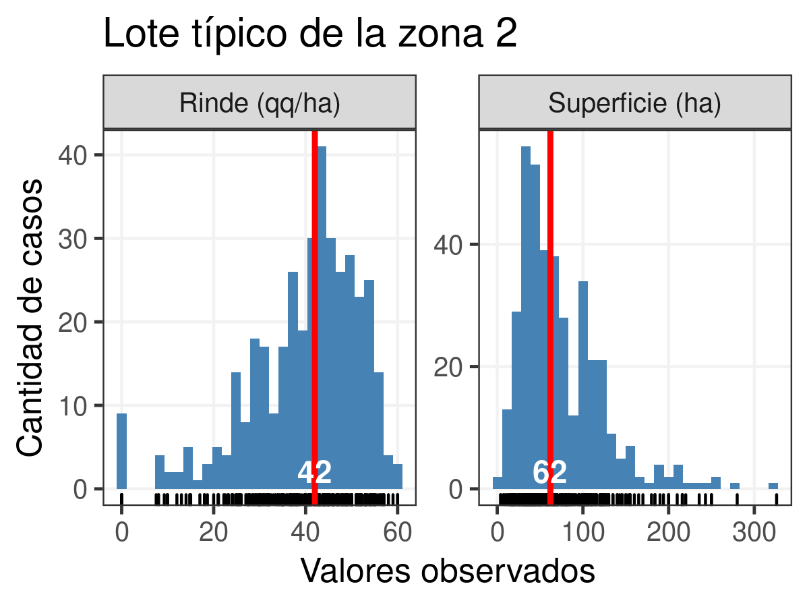
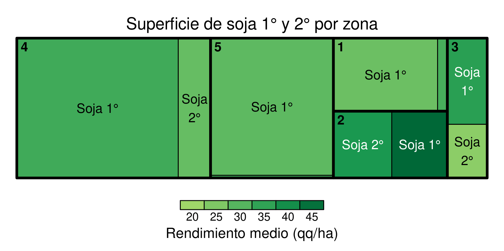
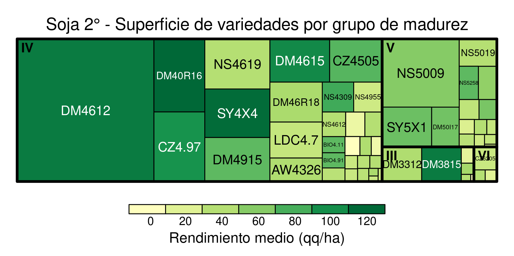
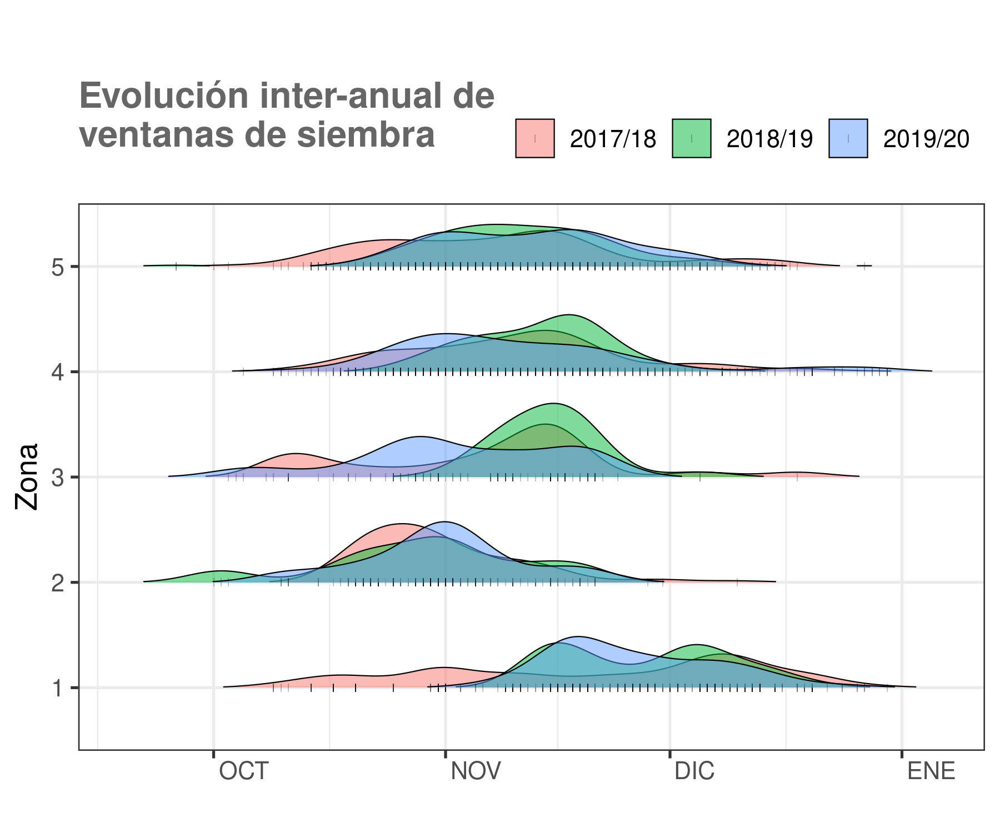
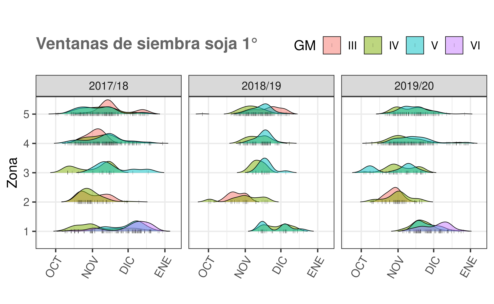
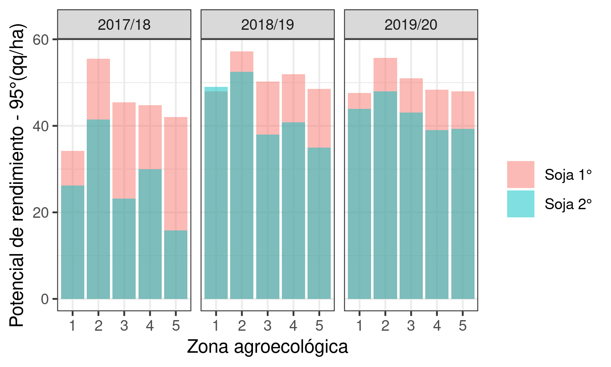

  - [carpeta de
    imágenes](https://github.com/juanchiem/soybean/tree/master/plots)

  - [carpeta de
    datos](https://github.com/juanchiem/soybean/tree/master/data)

# Superficies

## Lote medio de cada zona (2017-2020)

lote\_tipico\_zona1.png 
lote\_tipico\_zona2.png 
lote\_tipico\_zona3.png 
lote\_tipico\_zona4.png 
lote\_tipico\_zona5.png 

## Superficie por zona / regional / campaña

sup\_campana\_zona.png 

## Area de siembra de GM por zona y tipo de cultivo de soja

tortas\_soja\_GM.png 

## Tree maps

sup\_sj.png 

sup\_sj1.png 

sup\_sj1\_GM3.png 

sup\_sj1\_GM4.png 

sup\_sj1\_GM5.png 

sup\_sj1\_GM6.png 

sup\_sj2.png 

## Adopcion de tencologias

evolucion\_RR.png 

evolucion\_STS.png 

# Manejo

## Ventanas de siembra por zona / GM

ventanas\_siembra\_campana.png 

### Soja 1°

ventanas\_siembra\_sj1\_GM.png 

ventanas\_siembra\_sj1\_GM\_campana.png

fosforo\_respuesta18.png 

### Soja 2°

ventanas\_siembra\_sj2.png 

## Rendimientos por fecha de siembra x zona

(El suavizado de la tendencia esta hecho con modelo polinomial de grado
2, o sea que puede ser lineal o cuadratico el ajuste)

### Soja 1°

rinde\_Fsiembra\_sj1.png 

### Soja 2°

rinde\_Fsiembra\_sj2.png 

## Efecto Antecesor

### Con efecto napa

efecto\_antecesor\_napa.png 

### Sin efecto napa

efecto\_antecesor.png 

## Fósforo

fosforo\_respuesta.png 

fosforo\_dosis.png 

balance\_fosforo.png 

fosforo\_respuesta12.png 

fosforo\_respuesta18.png 

# Variedades

## Potencial ambiente

potencial\_ambiente.png 

[Soja 1° - rinde de variedades mas sembradas por
zona](https://docs.google.com/spreadsheets/d/1YL6vwgVu1nyMuZLRZw5uMav7cMt2mDXd7mI2S8Q6Q7c/edit#gid=285024912)
