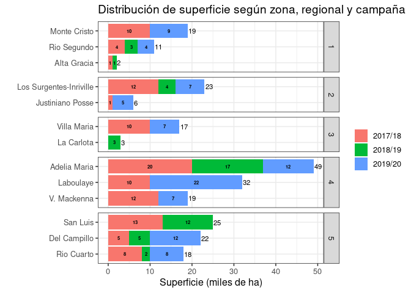

<!-- README.md is generated from README.Rmd. Please edit that file -->

Algunas referencias para tener en cuenta:

[Revista Horizonte
digital](https://issuu.com/horizonteadigital/docs/ha_130)

## Dataset

    #> Rows: 2,514
    #> Columns: 20
    #> $ campana                 <chr> "2018/19", "2018/19", "2018/19", "2018/19", "…
    #> $ zona                    <dbl> 4, 4, 4, 4, 4, 4, 4, 4, 4, 5, 4, 4, 4, 4, 5, …
    #> $ regional                <chr> "Adelia Maria", "Adelia Maria", "Adelia Maria…
    #> $ localidad               <chr> "Adelia María", "Adelia María", "Adelia María…
    #> $ clase_de_suelo          <chr> "Sin dato", "Sin dato", "Sin dato", "Sin dato…
    #> $ cultivo                 <chr> "Soja 1°", "Soja 1°", "Soja 1°", "Soja 2°", "…
    #> $ rinde                   <dbl> 42, 37, 34, 27, 46, 31, 50, 49, 36, 39, 39, 3…
    #> $ antecesor_invernal_18_1 <chr> "Barbecho", "Barbecho", "Barbecho", "Trigo co…
    #> $ antecesor_estival_17_18 <chr> "Soja", "Soja", "Soja", NA, "Maíz", "Maíz", "…
    #> $ fecha_siembra           <date> 2018-11-22, 2018-11-19, 2018-11-18, 2018-12-…
    #> $ variedad                <chr> "FN 4.97", "FN 4.97", "NA 5009", "NA 5019", "…
    #> $ grupo_de_madurez        <chr> "IV", "IV", "V", "V", "V", "IV", "IV", "IV", …
    #> $ espaciamiento_cm        <dbl> 42, 42, 42, 42, 26, 26, 42, 38, 52, 35, 26, 2…
    #> $ densidad                <lgl> NA, NA, NA, NA, NA, NA, NA, NA, NA, NA, NA, N…
    #> $ riego                   <chr> "No", "No", "No", "No", "No", "No", "No", "No…
    #> $ napa                    <chr> "Sin influencia", "Sin influencia", "Sin infl…
    #> $ adversidad_1            <chr> "Sin adversidad", "Granizo", "Sin adversidad"…
    #> $ dano_1                  <dbl> 0, 35, 0, 0, 0, 15, 0, 0, 10, 0, 0, 0, 0, 0, …
    #> $ adversidad_2            <chr> "Sin adversidad", "Sin adversidad", "Sin adve…
    #> $ dano_2                  <dbl> 0, 0, 0, 0, 0, 0, 0, 0, 0, 0, 0, 0, 0, 0, 0, …

### Cantidad de datos faltantes por variable:

| campana | zona | regional | localidad | clase\_de\_suelo | cultivo | rinde | antecesor\_invernal\_18\_1 | antecesor\_estival\_17\_18 | fecha\_siembra | variedad | grupo\_de\_madurez | espaciamiento\_cm | densidad | riego | napa | adversidad\_1 | dano\_1 | adversidad\_2 | dano\_2 |
| ------: | ---: | -------: | --------: | ---------------: | ------: | ----: | -------------------------: | -------------------------: | -------------: | -------: | -----------------: | ----------------: | -------: | ----: | ---: | ------------: | ------: | ------------: | ------: |
|       0 |    0 |        0 |         0 |                0 |       0 |     0 |                          9 |                       1011 |             39 |        1 |                  4 |                 5 |     1581 |    14 |    0 |             2 |       0 |           990 |       0 |

## Fecha de siembra x GM

<!-- -->

## Fecha de siembra x rinde

<!-- -->

## Variedades

| grupo\_de\_madurez | variedad          |   n |
| :----------------- | :---------------- | --: |
| IV                 | DM 4612           | 337 |
| IV                 | CZ 4.97           | 220 |
| IV                 | DM 40R16          | 159 |
| V                  | N 5009            | 159 |
| IV                 | N 4619            |  69 |
| V                  | DM 50I17          |  69 |
| V                  | NA 5009           |  67 |
| V                  | SY 5X1            |  66 |
| IV                 | DM 46R18          |  62 |
| IV                 | CZ 4505           |  52 |
| IV                 | DM 4615           |  43 |
| V                  | DM 5351           |  43 |
| V                  | LDC 5.3           |  43 |
| IV                 | DM 4615 STS       |  41 |
| IV                 | FN 4.5            |  39 |
| IV                 | SYN 4X4           |  35 |
| III                | SRM 3988          |  29 |
| IV                 | FN 4.35           |  28 |
| III                | DM 3312           |  26 |
| IV                 | BIO 4.6           |  25 |
| IV                 | DM 4915           |  24 |
| IV                 | DM 4915 IPRO      |  23 |
| V                  | DM 53I53          |  22 |
| V                  | N 5258            |  21 |
| III                | SOJA K 4001 NO RR |  20 |
| IV                 | N 4309            |  20 |
| V                  | DM 52R19          |  20 |
| IV                 | AW 4326 IPRO      |  19 |
| IV                 | LDC 4.7           |  19 |
| V                  | N 5019 IPRO       |  19 |
| III                | DM 3810           |  18 |
| IV                 | N 4955            |  18 |
| IV                 | SPS 4X4           |  18 |
| IV                 | SY 4X4            |  18 |
| V                  | NS 5258           |  16 |
| V                  | SPS 5X1           |  16 |
| IV                 | FN 4.97           |  15 |
| VI                 | CZ 6205           |  15 |
| VI                 | SOJA K 6501       |  15 |
| IV                 | CZ4505            |  14 |
| V                  | 53MS01 IPRO       |  14 |
| VI                 | K 6000            |  14 |
| IV                 | SOJA K 4616 NO RR |  13 |
| III                | SYN 3X7           |  12 |
| IV                 | MS 4.4 IPRO STS   |  12 |
| V                  | 53 MS 01 IPRO     |  12 |
| III                | DM 3815           |  11 |
| IV                 | DM 4212 STS       |  11 |
| IV                 | DM 46I17          |  11 |
| IV                 | DM 4913           |  11 |
| IV                 | DM 49R19          |  11 |
| V                  | DM 50I17 STS      |  10 |
| V                  | RA 549 RR1        |  10 |
| IV                 | AW 4326           |   9 |
| III                | DM 3815 IPRO      |   8 |
| IV                 | 47MS01            |   8 |
| IV                 | SRM 4602 STS      |   8 |
| V                  | CZ 4.97           |   8 |
| V                  | SYN 5X1           |   8 |
| VI                 | DM 60I62          |   8 |
| III                | DM 3815 IPRO STS  |   7 |
| IV                 | BIO 4.51          |   7 |
| IV                 | DM 4212           |   7 |
| IV                 | N 4612            |   7 |
| V                  | EXPERIMENTAL      |   7 |
| VI                 | EXPERIMENTAL      |   7 |
| IV                 | AW 4927 IPRO      |   6 |
| IV                 | DM 4618           |   6 |
| IV                 | MEZCLA            |   6 |
| V                  | N 5028            |   6 |
| V                  | NA 5258           |   6 |
| IV                 | CZ 4306           |   5 |
| IV                 | DS 1470           |   5 |
| IV                 | N 4619 IPRO       |   5 |
| IV                 | NA 4619I          |   5 |
| VI                 | K 6501            |   5 |
| \-                 | N 4309            |   4 |
| IV                 | DM 4619           |   4 |
| IV                 | DM4612            |   4 |
| V                  | CZ 5407 IPRO      |   4 |
| V                  | FN 4.5            |   4 |
| V                  | NA 5019           |   4 |
| \-                 | DM 4612           |   3 |
| IV                 | 4500              |   3 |
| IV                 | A 4500            |   3 |
| IV                 | BIO 4.11          |   3 |
| IV                 | BIO 4.91          |   3 |
| IV                 | DM 4615¿          |   3 |
| IV                 | NA 4990           |   3 |
| IV                 | NS 4611           |   3 |
| IV                 | NS 4955           |   3 |
| V                  | 50MS01 STS        |   3 |
| V                  | CZ 5907 IPRO      |   3 |
| V                  | DM 4915           |   3 |
| V                  | HO 5310           |   3 |
| V                  | K 5102            |   3 |
| V                  | LDC 5.9           |   3 |
| V                  | N 5019            |   3 |
| V                  | ND 4955           |   3 |
| VI                 | CZ 6505           |   3 |
| VI                 | DM 6.2            |   3 |
| VI                 | DM 62R63          |   3 |
| \-                 | BIO 4.11          |   2 |
| \-                 | DM 3312           |   2 |
| \-                 | DM 46R18          |   2 |
| \-                 | OTRO              |   2 |
| III                | CZ 3906 IPRO STS  |   2 |
| IV                 | AW 4500           |   2 |
| IV                 | AW 4927           |   2 |
| IV                 | DM 4413           |   2 |
| IV                 | DM 4613           |   2 |
| IV                 | DM 4614           |   2 |
| IV                 | DM 4616           |   2 |
| IV                 | DM 46I17 IPRO     |   2 |
| IV                 | H 4919            |   2 |
| IV                 | NA 4955           |   2 |
| IV                 | NS 4309           |   2 |
| IV                 | NS 4611 STS       |   2 |
| IV                 | SPS4X4            |   2 |
| V                  | 50MS01            |   2 |
| V                  | AW 5815 IPRO      |   2 |
| V                  | BIO 5.4           |   2 |
| V                  | CZ 5107           |   2 |
| V                  | DM 4612           |   2 |
| V                  | DM 5.9            |   2 |
| V                  | DM 5258           |   2 |
| V                  | DM 60I62          |   2 |
| V                  | DOW 1505          |   2 |
| V                  | H 5310            |   2 |
| V                  | K 6000            |   2 |
| V                  | LD 5.3            |   2 |
| V                  | N 5419            |   2 |
| VI                 | 60MS01            |   2 |
| VI                 | AW 6211 IPRO      |   2 |
| VI                 | DM 63I64          |   2 |
| \-                 | BIO HB4           |   1 |
| \-                 | VARIAS            |   1 |
| III                | ACA3535           |   1 |
| III                | BIO 3.41          |   1 |
| III                | DM 40R16          |   1 |
| III                | DM3312            |   1 |
| iv                 | DM 4615           |   1 |
| IV                 | 4619              |   1 |
| IV                 | AW 4736           |   1 |
| IV                 | AW 4736 IPRO      |   1 |
| IV                 | AW CN4612         |   1 |
| IV                 | AW CN4812         |   1 |
| IV                 | BIO 4.90          |   1 |
| IV                 | BIO HB4           |   1 |
| IV                 | CZ 4.55           |   1 |
| IV                 | CZ 4606           |   1 |
| IV                 | DM 4210           |   1 |
| IV                 | DM 4620           |   1 |
| IV                 | DM 4621           |   1 |
| IV                 | DM 4622           |   1 |
| IV                 | DM 4712           |   1 |
| IV                 | DM 47I17          |   1 |
| IV                 | DM 52R19          |   1 |
| IV                 | DM 5351           |   1 |
| IV                 | DM 5958           |   1 |
| IV                 | HO 5010           |   1 |
| IV                 | INTA              |   1 |
| IV                 | N 3988            |   1 |
| IV                 | N 4212            |   1 |
| IV                 | N 4615            |   1 |
| IV                 | N 4618            |   1 |
| IV                 | N 5030            |   1 |
| IV                 | NA 4309           |   1 |
| IV                 | NA 4613           |   1 |
| IV                 | NA 5009           |   1 |
| IV                 | NS 4903           |   1 |
| IV                 | NS4309            |   1 |
| IV                 | RSM 3988          |   1 |
| v                  | SY 5X1            |   1 |
| V                  | 59MS01 IPRO       |   1 |
| V                  | AW 5419 IPRO      |   1 |
| V                  | AW 5714           |   1 |
| V                  | AW 5815           |   1 |
| V                  | BIO HB4           |   1 |
| V                  | CZ 4306           |   1 |
| V                  | DM 4919           |   1 |
| V                  | DM 49R19          |   1 |
| V                  | DM 5010           |   1 |
| V                  | DM 50R18          |   1 |
| V                  | DM 55R20          |   1 |
| V                  | DM 5958           |   1 |
| V                  | DM 5958 IPRO      |   1 |
| V                  | DM50I17           |   1 |
| V                  | FN 5.55           |   1 |
| V                  | HO 5010           |   1 |
| V                  | K 6501            |   1 |
| V                  | MEZCLA            |   1 |
| V                  | N 5208            |   1 |
| V                  | N 5259            |   1 |
| V                  | N5009             |   1 |
| V                  | NS 5009           |   1 |
| V                  | NS 5028           |   1 |
| V                  | SY 5X2            |   1 |
| VI                 | 60MS01 STS        |   1 |
| VI                 | 66MS01            |   1 |
| VI                 | AW 6210 IPRO      |   1 |
| VI                 | AW 6211           |   1 |
| VI                 | AW 6410 IPRO      |   1 |
| VI                 | DM 62R62          |   1 |
| VI                 | FN 625            |   1 |
| VI                 | K 6970            |   1 |
| VI                 | N 6859            |   1 |
| NA                 | 0                 |   1 |
| NA                 | MEZCLA            |   1 |
| NA                 | SOJA K 6000 NO RR |   1 |
| NA                 | NA                |   1 |
