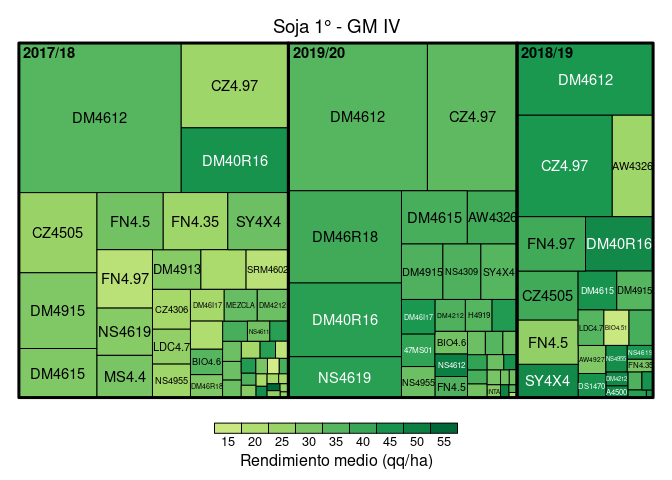
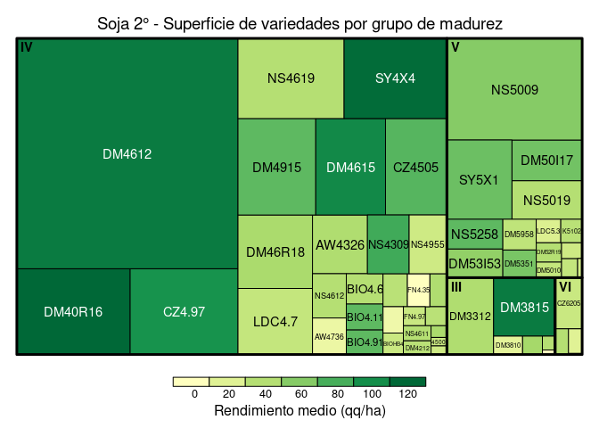

Algunas referencias para tener en cuenta:

[Revista Horizonte
digital](https://issuu.com/horizonteadigital/docs/ha_130)

## Dataset

    #> Rows: 2,707
    #> Columns: 24
    #> $ campana                 <chr> "2017/18", "2017/18", "2017/18", "2017/18", "…
    #> $ zona                    <chr> "1", "1", "1", "1", "1", "1", "1", "1", "1", …
    #> $ regional                <chr> "Alta Gracia", "Alta Gracia", "Alta Gracia", …
    #> $ localidad               <chr> "0", "0", "0", "0", "0", "0", "0", "0", "Vill…
    #> $ clase_de_suelo          <chr> "III", "III", "III", "III", "III", "III", "II…
    #> $ cultivo                 <chr> "soja_1", "soja_1", "soja_1", "soja_1", "soja…
    #> $ superficie              <dbl> 120.80, 14.50, 214.98, 100.00, 15.87, 13.71, …
    #> $ rinde                   <dbl> 2.80, 3.50, 3.80, 37.00, 3.90, 4.50, 34.00, 2…
    #> $ antecesor_invernal_18_1 <chr> "Maíz", "Maíz", "Maíz", "Maíz", "Maíz", "Maíz…
    #> $ antecesor_estival_17_18 <lgl> NA, NA, NA, NA, NA, NA, NA, NA, NA, NA, NA, N…
    #> $ fecha_siembra           <date> 2018-11-15, 2018-12-15, 2018-12-15, 2018-12-…
    #> $ variedad                <chr> "DM50I17", "DM50I17", "DM50I17", "DM50I17", "…
    #> $ GM                      <chr> "V", "V", "V", "V", "V", "V", "V", "V", "V", …
    #> $ semillero               <chr> "DON MARIO", "DON MARIO", "DON MARIO", "NIDER…
    #> $ espaciamiento_cm        <dbl> 42, 52, 52, 52, 52, 52, 52, 42, 42, 0, 0, 0, …
    #> $ densidad                <lgl> NA, NA, NA, NA, NA, NA, NA, NA, NA, NA, NA, N…
    #> $ riego                   <chr> "NO", "NO", "NO", "NO", "NO", "NO", "NO", "NO…
    #> $ napa                    <chr> "SI", "SI", "SI", "SI", "SI", "SI", "SI", "SI…
    #> $ adversidad_1            <chr> "0", "0", "0", "0", "0", "0", "0", "0", "Sequ…
    #> $ dano_1                  <dbl> 0, 0, 0, 0, 0, 0, 0, 0, 0, 0, 0, 0, 0, 0, 0, …
    #> $ adversidad_2            <lgl> NA, NA, NA, NA, NA, NA, NA, NA, NA, NA, NA, N…
    #> $ dano_2                  <dbl> 0, 0, 0, 0, 0, 0, 0, 0, 0, 0, 0, 0, 0, 0, 0, …
    #> $ dano_tot                <dbl> 0, 0, 0, 0, 0, 0, 0, 0, 0, 0, 0, 0, 0, 0, 0, …
    #> $ id_row                  <int> 1, 2, 3, 4, 5, 6, 7, 8, 9, 10, 11, 12, 13, 14…

  - Nro de observaciones por campaña / ecoregión / regional

| campana | zona | regional                |   n |
| :------ | :--- | :---------------------- | --: |
| 2017/18 | 1    | Alta Gracia             |   9 |
| 2017/18 | 1    | Monte Cristo            | 201 |
| 2017/18 | 1    | Rio Segundo             |  52 |
| 2017/18 | 2    | Justiniano Posse        |  12 |
| 2017/18 | 2    | Los Surgentes-Inriville | 154 |
| 2017/18 | 3    | Villa Maria             |  46 |
| 2017/18 | 4    | Adelia Maria            | 172 |
| 2017/18 | 4    | Laboulaye               | 138 |
| 2017/18 | 4    | V. Mackenna             | 123 |
| 2017/18 | 5    | Del Campillo            |  51 |
| 2017/18 | 5    | Rio Cuarto              |  65 |
| 2017/18 | 5    | San Luis                | 127 |
| 2018/19 | 1    | Alta Gracia             |   8 |
| 2018/19 | 1    | Rio Segundo             |  37 |
| 2018/19 | 2    | Justiniano Posse        |   1 |
| 2018/19 | 2    | Los Surgentes-Inriville |  63 |
| 2018/19 | 3    | La Carlota              |  29 |
| 2018/19 | 4    | Adelia Maria            | 155 |
| 2018/19 | 5    | Del Campillo            |  52 |
| 2018/19 | 5    | Rio Cuarto              |  25 |
| 2018/19 | 5    | San Luis                | 120 |
| 2019/20 | 1    | Monte Cristo            | 159 |
| 2019/20 | 1    | Rio Segundo             |  64 |
| 2019/20 | 2    | Justiniano Posse        |  64 |
| 2019/20 | 2    | Los Surgentes-Inriville |  96 |
| 2019/20 | 3    | Villa Maria             |  95 |
| 2019/20 | 4    | Adelia Maria            | 159 |
| 2019/20 | 4    | Laboulaye               | 209 |
| 2019/20 | 4    | V. Mackenna             |  54 |
| 2019/20 | 5    | Del Campillo            | 127 |
| 2019/20 | 5    | Rio Cuarto              |  40 |

  - Cantidad de datos faltantes por variable

| variable                   | datos | datos\_faltantes |
| :------------------------- | ----: | ---------------: |
| campana                    |  2707 |                0 |
| zona                       |  2707 |                0 |
| regional                   |  2707 |                0 |
| localidad                  |  2707 |                0 |
| clase\_de\_suelo           |  2707 |                0 |
| cultivo                    |  2707 |                0 |
| superficie                 |  2707 |                0 |
| rinde                      |  2696 |               11 |
| antecesor\_invernal\_18\_1 |  2698 |                9 |
| antecesor\_estival\_17\_18 |     0 |             2707 |
| fecha\_siembra             |  2663 |               44 |
| variedad                   |  2706 |                1 |
| GM                         |  2699 |                8 |
| semillero                  |  2706 |                1 |
| espaciamiento\_cm          |  2702 |                5 |
| densidad                   |   946 |             1761 |
| riego                      |  2693 |               14 |
| napa                       |  2707 |                0 |
| adversidad\_1              |  2705 |                2 |
| dano\_1                    |  2368 |              339 |
| adversidad\_2              |     0 |             2707 |
| dano\_2                    |  2653 |               54 |
| dano\_tot                  |  2364 |              343 |
| id\_row                    |  2707 |                0 |

## Superficie (tamaño de cuadrados) y rendimientos (intensidad de color) por GM

<!-- -->

<!-- -->

## Fecha de siembra x GM

  - Evolución de fecha de siembra por zona

<!-- -->

## Fecha de siembra x rinde

  - Rendimientos por fecha de siembra x zona

<!-- -->

  - Tomar las 5 variedades mas sembradas de cada GM y ver distribucion
    de rendimientos (por zona, para no meter ruido del potencial de las
    mismas??

## Variedades

    #> # A tibble: 147 x 2
    #>    variedad     n
    #>    <chr>    <int>
    #>  1 DM4612     362
    #>  2 NA5009     294
    #>  3 CZ4.97     241
    #>  4 DM40R16    167
    #>  5 DM4615      90
    #>  6 DM50I17     87
    #>  7 SY5X1       77
    #>  8 NS4619      75
    #>  9 CZ4505      72
    #> 10 DM46R18     70
    #> # … with 137 more rows

### Soja 1°

<!-- -->

### Soja 2°

<!-- -->

  - Analisis de evolucion de uso de biotecnologia por campaña

  - Analisis de efecto napa y agua a la siembra por año y por zona

  - Arbol de regresion para rendimiento: que variables explican cada
    rango de rendimiento??
