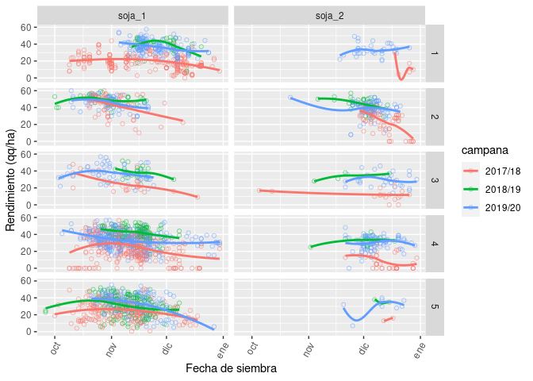

<!-- README.md is generated from README.Rmd. Please edit that file -->

Algunas referencias para tener en cuenta:

[Revista Horizonte
digital](https://issuu.com/horizonteadigital/docs/ha_130)

## Dataset

    #> Rows: 2,707
    #> Columns: 21
    #> $ campana                 <chr> "2018/19", "2018/19", "2018/19", "2018/19", "…
    #> $ zona                    <chr> "5", "5", "5", "5", "5", "5", "5", "5", "5", …
    #> $ regional                <chr> "San Luis", "San Luis", "San Luis", "San Luis…
    #> $ localidad               <chr> "SER BEEF SA", "SER BEEF SA", "SER BEEF SA", …
    #> $ clase_de_suelo          <chr> "Sin dato", "Sin dato", "Sin dato", "Sin dato…
    #> $ cultivo                 <chr> "soja_1", "soja_1", "soja_1", "soja_1", "soja…
    #> $ rinde                   <dbl> 36, 27, 34, 20, 34, 17, 21, 31, 23, 24, 31, 3…
    #> $ antecesor_invernal_18_1 <chr> "Barbecho", "Barbecho", "Barbecho", "Barbecho…
    #> $ antecesor_estival_17_18 <chr> "Soja", "Maíz", "Soja", "Maíz", "Maíz", "Maíz…
    #> $ fecha_siembra           <date> 2018-11-09, 2018-11-03, 2018-11-29, 2018-11-…
    #> $ variedad                <chr> "SRM3988", "SRM3988", "SRM3988", "SRM3988", "…
    #> $ GM                      <chr> "III", "III", "III", "III", "III", "III", "II…
    #> $ espaciamiento_cm        <dbl> 35, 35, 38, 40, 38, 40, 40, 38, 38, 38, 38, 4…
    #> $ densidad                <chr> NA, NA, NA, NA, NA, NA, NA, NA, NA, NA, NA, N…
    #> $ riego                   <chr> "NO", "NO", "NO", "NO", "NO", "NO", "NO", "NO…
    #> $ napa                    <chr> "Sin influencia", "Sin influencia", "Sin infl…
    #> $ adversidad_1            <chr> "Sin adversidad", "Sin adversidad", "Sin adve…
    #> $ dano_1                  <dbl> 0, 0, 0, 0, 0, 0, 0, 0, 0, 0, 0, 0, 0, 0, 0, …
    #> $ adversidad_2            <chr> "Sin adversidad", "Sin adversidad", "Sin adve…
    #> $ dano_2                  <dbl> 0, 0, 0, 0, 0, 0, 0, 0, 0, 0, 0, 0, 0, 0, 0, …
    #> $ dano_tot                <dbl> 0, 0, 0, 0, 0, 0, 0, 0, 0, 0, 0, 0, 0, 0, 0, …

### Cantidad de datos faltantes por variable:

| campana | zona | regional | localidad | clase\_de\_suelo | cultivo | rinde | antecesor\_invernal\_18\_1 | antecesor\_estival\_17\_18 | fecha\_siembra | variedad | GM | espaciamiento\_cm | densidad | riego | napa | adversidad\_1 | dano\_1 | adversidad\_2 | dano\_2 | dano\_tot |
| ------: | ---: | -------: | --------: | ---------------: | ------: | ----: | -------------------------: | -------------------------: | -------------: | -------: | -: | ----------------: | -------: | ----: | ---: | ------------: | ------: | ------------: | ------: | --------: |
|       0 |    0 |        0 |         0 |                0 |       0 |    11 |                          9 |                       1171 |             44 |        1 |  8 |                 5 |     1650 |    14 |    0 |             2 |     426 |          1150 |     498 |       498 |

## Fecha de siembra x GM

<!-- -->

## Fecha de siembra x rinde

<!-- -->

## Variedades

    #> # A tibble: 163 x 2
    #>    variedad     n
    #>    <chr>    <int>
    #>  1 DM4612     362
    #>  2 CZ4.97     241
    #>  3 N5009      218
    #>  4 DM40R16    167
    #>  5 DM4615      87
    #>  6 DM50I17     87
    #>  7 N4619       75
    #>  8 CZ4505      70
    #>  9 NA5009      68
    #> 10 SY5X1       67
    #> # … with 153 more rows

### Soja 1°

<!-- -->

### Soja 2°

<!-- -->
